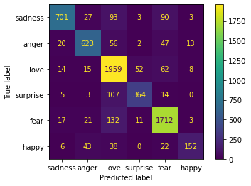

# Szöveg és Webbányászat projektfeladat

## 1. Szükséges csomagok
* pandas
* numpy
* matplotlib
* seaborn
* sklearn
* wordcloud

## 2. Adathalmaz
A feladatomhoz egy a [Kaggle-ön](https://www.kaggle.com/ishantjuyal/emotions-in-text) fellelhető adathalmazt használtam. Ez az adathalmaz különböző forrásokból összegyűjtött rövid szövegek, üzenetek amelyek valamilyen érzelmet fejeznek ki.\
Két oszlopból és 21460 sorból álló a szöveges fájl, ahol
* az első oszlop a **szöveg**, 
* a második oszlop pedig az **érzelem**.

## 3. Feladat

### 3.1 Leírás
Az adatkészlet lehetőséget ad arra, hogy a szövegeket ne szimplán pozitív, negítv vagy semleges érzelem szerint osztályozzuk.\
Hanem még ettől is részletesebb kategóriákba tudjuk sorolni azokat.
Úgymint: 
* boldogság
* szomorúság
* szerelem
* félelem
* meglepődöttség
* harag

|  |
| :---: |
| _**Statisztika:** A szöveges állomány sorainak alakulása._ |

A kapott statisztikán látható, hogy kicsit el van tolódva a boldog és szomorú érzelmek irányába az adatkészlet sorai. De remélhetőleg ez nem befolyásolja a tanítás hatékonyságát, mivel viszonylag sok példa áll rendelkezésre még a legkisebb esetén is.

|  |
| :---: |
| _**Szófelhő:** A szöveges állományban előforduló szavak gyakorisága._ |

A szavakat gyakoriságuk alapján megvizsgálva, a szófelhő segítségével vizualizálva jól látható módon elég nagy hányadban tulajdonságot és valamilyen cselekvést fejeznek ezek ki.

### 3.2 Megvalósítás

Az osztályozási feladat megvalósítására 3 különböző osztályozót választottam, melyek a következők:
1. **RandomForestClassifier**
2. **MultinomialNB**
3. **SGDClassifier**

### 3.3 Eredmények
| Osztályozó neve |  Confusion mátrix  | Pontossága |
| :---        |    :----:   | :---: |
| **RandomForestClassifier** |  | ~ 84% |
| **MultinomialNB** |  | ~ 81% |
| **SGDClassifier** |  | ~ 86% |

\
Az osztályzók részletes pontossága az egyes célváltozóknál:

| Osztályozó neve | sadness | anger | love | surprise | fear | happy | Összesítve | 
| :--- | :----: | :---: | :---: | :---: | :---: | :---: | :---: |
| **RandomForestClassifier** | 81% | 78% | 86% | 81% | 89% | 74% | 84% |
| **MultinomialNB** | 92% | 86% | 75% | 98% | 80% | 97% | 81% |
| **SGDClassifier** | 92% | 85% | 82% | 84% | 88% | 85% | 86% |

\
A három osztályozó közül a Stochastic Gradient Descent (SGDClassifier) bizonyult ebben az esetben a leghatékonyabbnak. De a többi sem szégyenkezhet, összeségében elég jó (80% feletti) hatékonyságot sikerült elérni mindegyikkel.